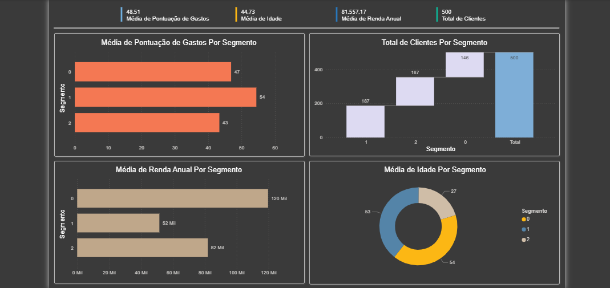

# 📊 Segmentação de Clientes para área de Marketing

Este projeto tem como objetivo analisar uma base de clientes segmentada previamente por clusterização (provavelmente via K-Means) com foco em apoiar estratégias de marketing mais direcionadas. Através do Power BI, foi criado um dashboard que revela padrões de comportamento com base em idade, renda anual e pontuação de gastos.

## 📁 Estrutura do Projeto
```
├── dashboard_lab_7.pbix       <- Arquivo Power BI
├── dataset.csv                <- Base de dados original
├── dashboard.png              <- Print do dashboard
├── capa.png                   <- Print da capa do dashboard
└── README.md                  <- Documentação do projeto
```

## 🔍 Visão Geral do Dashboard

O dashboard interativo apresenta indicadores de:

- Média de pontuação de gastos por segmento
- Total de clientes por segmento
- Média de renda anual por segmento
- Média de idade por segmento

Esses indicadores permitem identificar perfis distintos de clientes com base em seus comportamentos e características demográficas.

## 🧠 Segmentos de Clientes

A base de dados já continha uma coluna de segmentação (`cluster`) com três grupos: 0, 1 e 2. A seguir, os perfis médios identificados a partir da análise:

- **Cluster 0**: Clientes com idade média de **53 anos**, **alta renda** (R$ 120 mil) e **pontuação de gastos moderada** (pontuação: 47).
- **Cluster 1**: Clientes **jovens** (27 anos), com **menor renda** (R$ 52 mil), mas com a **maior pontuação de gastos** (pontuação: 54).
- **Cluster 2**: Clientes com idade média de **54 anos**, **renda média** (R$ 82 mil) e **menor engajamento de consumo** (pontuação: 43).

## 🛠️ Ferramentas Utilizadas

- [Power BI](https://powerbi.microsoft.com/) — para construção do dashboard e análise visual
- Microsoft Excel (apoio na análise exploratória)

## 📷 Visual do Projeto



## ✍️ Autoria

Este projeto foi desenvolvido como **exercício prático durante o curso “Microsoft Power BI Para Business Intelligence e Data Science” da [Data Science Academy](https://www.datascienceacademy.com.br/)**.  
A versão apresentada neste repositório foi adaptada por mim, **Barbara Angélica**, como parte da construção do meu portfólio na área de Ciência de Dados.

🔗 [LinkedIn](https://www.linkedin.com/in/barbara-angélica)
